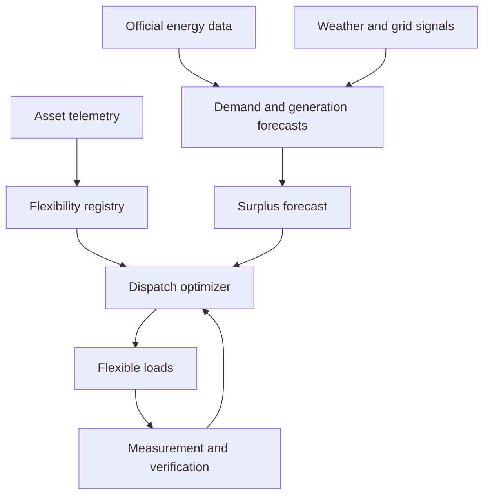

# SurplusZero AI

**Predictive load orchestration for near-zero avoidable renewable-energy curtailment in Saudi Arabia.**

SurplusZero AI converts distributed flexible loads into a **Virtual Energy Reservoir**. It forecasts periods when available electricity may exceed normal demand, reserves suitable flexible loads before the event, dispatches them when needed, verifies their actual response, and reallocates any shortfall.

> Every usable surplus kilowatt-hour should be directed to its highest-value available use before curtailment becomes necessary.

## The challenge

Saudi Arabia is rapidly expanding renewable generation. By the end of 2024, the Kingdom had **6,551 MW** of operating renewable capacity: **6,151 MW solar** and **400 MW wind**, according to GASTAT's *Renewable Energy Statistics 2024*.

As variable renewable capacity increases, generation can sometimes exceed the demand, storage, export, or network capacity available at a particular time and location. If the system cannot safely absorb the energy, renewable output may need to be curtailed.

SurplusZero AI addresses the inverse of conventional demand management:

| Condition | Conventional response | SurplusZero response |
|---|---|---|
| Demand exceeds available supply | Reduce or shift consumption | Not the primary use case |
| Available generation exceeds normal demand | Curtail generation or charge available storage | Create and coordinate useful flexible demand |

The public datasets reviewed do **not** publish historical Saudi hourly curtailment. This project therefore does not claim that a measured national curtailment level already exists. It addresses the operational risk associated with increasing variable renewable penetration.

## Consequences of unmanaged surplus

- Renewable generation may be curtailed.
- Installed renewable assets may be underutilized.
- Frequency, voltage, congestion, and reserve management become more complex.
- A valuable zero-fuel-cost kilowatt-hour is lost instead of being converted into cooling, water, mobility, storage, industrial output, or hydrogen.
- Exclusive dependence on batteries can increase the cost of absorbing surplus.
- Midday renewable energy may be lost while evening demand still requires stored energy or dispatchable generation.

## The solution

SurplusZero AI coordinates a portfolio of flexible resources:

- Building and district cooling
- Chilled-water and ice storage
- Water pumping and desalination
- Cold storage and refrigeration
- Electric-vehicle charging
- Battery energy storage
- Flexible industrial processes
- Hydrogen electrolysers

Each resource declares its available power, energy capacity, timing, response speed, operational limits, location, cost, and confidence. The optimizer selects a safe portfolio that can absorb the predicted surplus at the lowest system cost.

## How it works



1. **Calibrate** national and regional baselines using official Saudi data.
2. **Forecast** demand and renewable generation at operational time resolution.
3. **Detect** a probable surplus window and quantify uncertainty.
4. **Reserve** more verified flexibility than the central forecast requires.
5. **Optimize** resources by location, speed, cost, capacity, and constraints.
6. **Dispatch** precise load-increase instructions.
7. **Measure** the delivered increase against each asset's baseline.
8. **Reallocate** underdelivery to standby resources.
9. **Report** verified absorbed energy and avoided curtailment potential.

## Core equations

Expected surplus:

```text
P_surplus(t) = max(0,
  P_generation(t)
  - P_demand(t)
  - P_export(t)
  - P_scheduled_storage(t)
)
```

Required reserved flexibility:

```text
P_reserved(t) >= P_forecast_surplus(t) + P_forecast_uncertainty(t)
```

Verified response from asset `i`:

```text
P_delivered_i(t) = P_actual_i(t) - P_baseline_i(t)
```

Underdelivery to be reallocated:

```text
P_shortfall(t) = P_requested(t) - P_delivered(t)
```

## What makes it different

The key innovation is not a dashboard or a single battery controller. It is a closed-loop, multi-sector orchestration system:

```text
Forecast → Reserve → Dispatch → Measure → Reallocate
```

A command is not counted as success. Only metered additional consumption is counted as absorbed surplus. When a resource underdelivers, the optimizer immediately transfers the missing allocation to a standby resource.

## Data-first design

SurplusZero separates every input and result into five provenance classes:

| Class | Meaning |
|---|---|
| Official | Published by a Saudi government authority |
| Measured | Received from a meter, sensor, or participating asset |
| Calculated | Derived directly from documented inputs |
| Forecast | Produced by a declared forecasting method |
| Assumed | Scenario input awaiting pilot validation |

The prototype is calibrated with actual Ministry of Energy, GASTAT, and SERA data. Annual official statistics are not misrepresented as real-time grid telemetry. Operational forecasts use weather observations and measured pilot data; production deployment would accept utility/grid signals through the same interfaces.

## Initial official datasets

| Dataset | Period | Primary use |
|---|---:|---|
| Renewable Energy Statistics | 2019–2024 | Project, technology, capacity, and LCOE baseline |
| Peak Load | 2017–2024 | National demand calibration |
| Consumer numbers and energy sales | 2023–2024 | Customer and market baseline |
| Electricity consumption by category | 2023–2024 | Flexible-load opportunity by sector |
| Total electricity users | 2017–2024 | Connected-customer growth |
| Regional seasonal electricity consumption | Multi-year | Regional and seasonal demand calibration |
| Licensed generation capacity by region | Multi-year | Regional supply limits |
| Electricity tariffs | Current publication | Incentive and economic calculations |

Full source links and dataset identifiers are maintained in [docs/data-sources.md](docs/data-sources.md).

## Doable prototype

The first demonstration is a **Surplus Absorption Zone**, not a national-grid controller.

It will include:

- One Saudi regional scenario
- Actual official energy datasets
- Actual weather observations
- A 15-minute demand and renewable-generation forecast
- A registry of buildings, water pumps, EV chargers, batteries, cold storage, and an optional electrolyser
- A dispatch optimizer
- One safe physical demonstration load with power measurement
- Automatic shortfall reallocation
- A dashboard showing source provenance and verified results

### Demonstration sequence

1. The platform predicts a surplus window.
2. It reserves flexible loads plus an uncertainty margin.
3. The event begins and selected assets are dispatched.
4. One asset intentionally underdelivers.
5. Metering detects the shortfall.
6. The optimizer reallocates it to a standby resource.
7. The dashboard reports only verified absorbed energy.

## Success metrics

- Surplus forecast error
- Verified absorption rate
- Flexibility delivery rate
- Response time
- Available flexible MW and MWh
- Avoided curtailment potential
- Reallocation success rate
- Customer override rate
- Comfort or process-limit violations
- Incentive cost per absorbed kWh
- Battery degradation cost

## Technical boundary

SurplusZero aims for **near-zero avoidable curtailment**, not an absolute guarantee of zero curtailment. Grid faults, local congestion, communications failure, full storage, insufficient flexibility, or system-security constraints can still make curtailment necessary.

## Documentation

- [Concept and methodology](docs/methodology.md)
- [System architecture](docs/architecture.md)
- [Official data catalogue](docs/data-sources.md)
- [Prototype and roadmap](docs/roadmap.md)
- [Run the Riyadh data pipeline](docs/running-the-pipeline.md)

## Project status

**Concept validation and hackathon prototype planning.**

No production grid connection, measured national curtailment result, or verified national saving is claimed at this stage.

## License

A license has not yet been selected. Until one is added, standard copyright applies.
