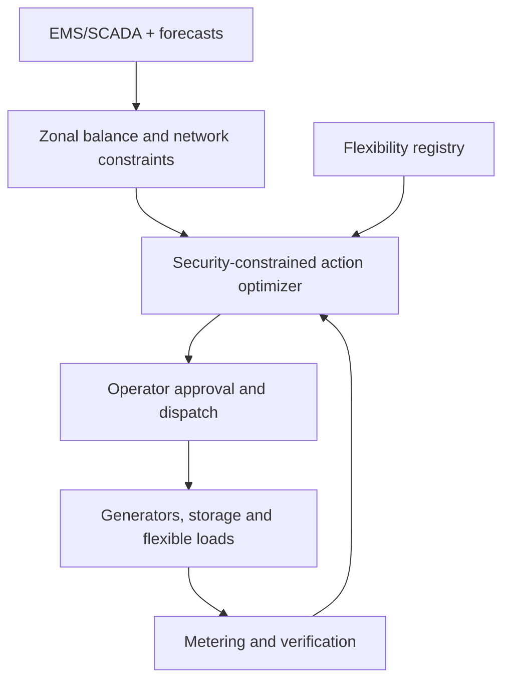

# System architecture

## Two control levels

SurplusZero has a national/zonal decision layer and an asset layer. The first determines where an excess exists and which grid actions are feasible. The second aggregates and verifies controllable loads. This separation prevents a local solar forecast from being mistaken for a national grid signal.

## Core services

| Service | Responsibility |
|---|---|
| Data gateway | Normalize generation, demand, tie lines, weather, constraints, offers, and meters with provenance |
| Forecast engine | Produce zonal demand and generation distributions at 5–15 minute resolution |
| Network-aware detector | Locate excess that may be hidden by the national aggregate |
| Flexibility registry | Maintain resource location, capacity, energy, ramp, constraints, price, and confidence |
| Action optimizer | Co-optimize transfer, redispatch, storage, flexible load, export, and residual curtailment |
| Operator console | Explain, approve, reject, or modify recommendations |
| Dispatch gateway | Send authenticated instructions to authorized plants, aggregators, and sites |
| Measurement/settlement | Verify response, reallocate shortfall, calculate KPIs, and preserve audit evidence |

## Security boundary

Grid and equipment protection always override optimization. Production use requires operator authorization, role-based access, encryption, signed instructions, local fail-safe logic, manual override, telemetry-quality checks, replay protection, and an immutable audit trail. The hackathon version is advisory and simulated except for any explicitly connected safe demonstration asset.

## Prototype stack

Python supplies deterministic balance logic and later forecasting/optimization; FastAPI can expose interfaces; PostgreSQL/TimescaleDB stores time series and provenance; MQTT or secure REST connects authorized edge gateways; and the current static dashboard demonstrates the national action waterfall.
