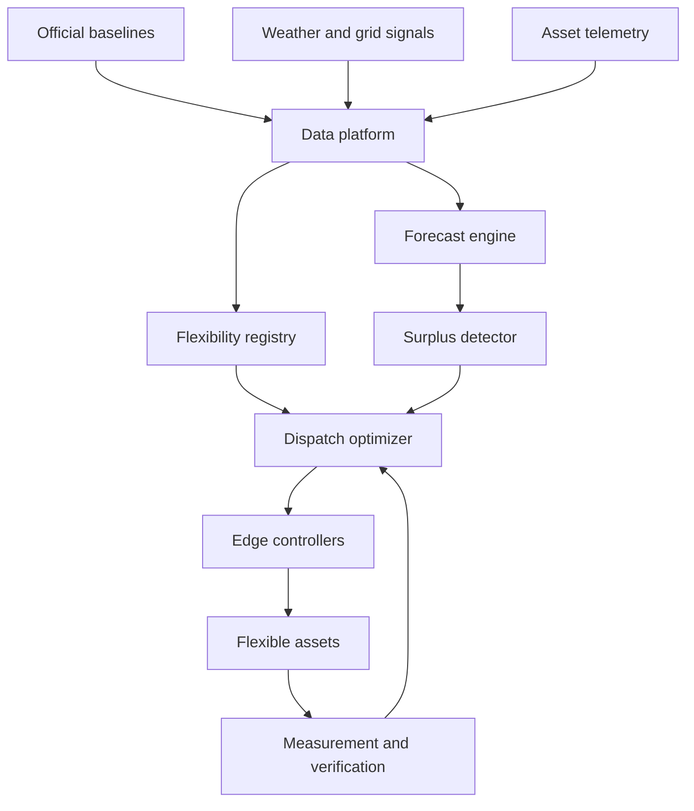

# System Architecture

## Design objective

SurplusZero AI creates a closed-loop connection between a predicted renewable surplus and verified additional useful demand.



## Components

### Data ingestion

Imports government CSV/XLSX/API data, weather observations, asset telemetry, and grid or scenario signals. Each record carries source, timestamp, unit, geography, frequency, and provenance class.

### Forecast engine

Produces 15-minute demand and renewable-generation forecasts with uncertainty bands. The initial model should prioritize transparent methods such as gradient boosting or classical time-series forecasting over unnecessary model complexity.

### Flexibility registry

Each asset publishes:

- Available power and energy
- Earliest start and latest finish
- Minimum run/rest time
- Ramp and response time
- Location or network zone
- Comfort/process constraints
- Activation cost
- Delivery confidence
- Telemetry status

### Surplus detector

```text
surplus = max(0,
  generation
  - demand
  - exports
  - scheduled_storage
)
```

### Dispatch optimizer

A linear or mixed-integer optimizer minimizes curtailment, incentives, degradation, comfort deviation, and network penalties subject to asset and system constraints.

### Edge control

A site gateway receives dispatch instructions, applies local safety and comfort rules, supports manual override, and reports measured response. Grid safety and local equipment protections always override optimization.

### Measurement and verification

Delivered flexibility is the metered load increase relative to an approved baseline. Underdelivery is reallocated to standby resources.

## Security and control boundary

- Authenticated and encrypted communication
- Role-based access
- Signed or traceable dispatch instructions
- Local failsafe behavior
- Manual override
- Audit log
- No direct control without asset-owner and system authorization
- No bypass of protection, grid-code, or equipment safety controls

## Suggested prototype stack

| Layer | Option |
|---|---|
| Database | PostgreSQL / Supabase |
| Forecasting and optimization | Python |
| API | FastAPI |
| Dashboard | React |
| Messaging | MQTT or secure REST |
| Edge device | ESP32 or Raspberry Pi |
| Visualization | Load curves, map, registry, dispatch ledger |
